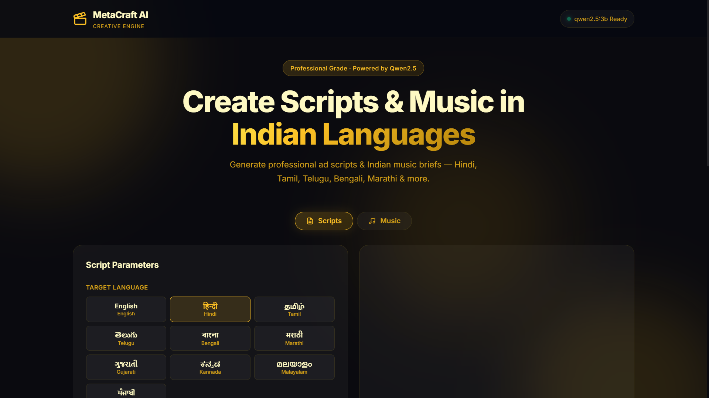

# MetaCraft AI — Indian Language Script Generator

> **AI-powered creative script generation in 9 Indian languages. 100% free. No API key required.**

Generate professional TV ads, radio spots, social media reels, and OTT pre-rolls in **Hindi, Tamil, Telugu, Bengali, Marathi, Gujarati, Kannada, Malayalam, and Punjabi** — with authentic Indian cultural context and festival awareness.

---

## Features
- 🌐 **9 Indian Languages** — all native scripts (Devanagari, Tamil, Telugu, Bengali, Gujarati, Gurmukhi, Kannada, Malayalam)
- 🎬 **5 Ad Formats** — TV Ad (30s/60s), Radio Spot, Social Media Reel, OTT Pre-roll
- 🎭 **6 Tones** — Emotional, Energetic, Humorous, Inspirational, Elegant, Informative
- 🪔 **Festival Contexts** — Diwali, Holi, Eid, Onam, Pongal, Navratri, and more
- 🏭 **10 Industries** — Telecom, FMCG, Fintech, E-Commerce, Jewellery, etc.
- 🤖 **Free AI** — Runs on Ollama + Qwen2.5:3b locally, no API key needed

---

## Screenshots




---

## Setup

### Prerequisites
1. **Python 3.9+** — [python.org](https://python.org)
2. **Ollama** — [ollama.com/download](https://ollama.com/download) (Windows installer)

### Installation (Windows)

**Option A: One-click setup**
```
Double-click setup.bat
```

**Option B: Manual**
```bash
# Install Python dependencies
pip install -r requirements.txt

# Pull the Qwen2.5 model (~2GB download, one-time)
ollama pull qwen2.5:3b

# Start the server
python -m uvicorn api.main:app --reload --port 8000
```

Then open **http://localhost:8000** in your browser.

---

## API Usage

### Generate a Script
```bash
POST /api/scripts/generate
```

**Example (Hindi TV Ad for Jio):**
```json
{
  "language": "hindi",
  "ad_format": "tv_ad_30",
  "brand_name": "Jio",
  "theme": "family staying connected during Diwali",
  "tone": "emotional",
  "industry": "telecom",
  "festival": "diwali"
}
```

**Example (Tamil Jewellery Ad):**
```json
{
  "language": "tamil",
  "ad_format": "tv_ad_60",
  "brand_name": "Tanishq",
  "theme": "wedding season gold",
  "tone": "elegant",
  "industry": "jewellery"
}
```

### Other Endpoints
| Endpoint | Description |
|---|---|
| `GET /api/health` | Check Ollama status |
| `GET /api/scripts/languages` | List supported languages |
| `GET /api/scripts/formats` | List ad formats |
| `GET /api/scripts/festivals` | List festival contexts |
| `GET /docs` | Interactive API docs |

---

## Project Structure
```
metacraft/
├── models/
│   ├── language_support.py     # 9 languages + 5 ad formats
│   ├── cultural_context.py     # Festivals, industries, tones
│   ├── few_shot_examples.py    # Per-language training examples
│   ├── prompt_builder.py       # Prompt assembly engine
│   └── script_generator.py    # Ollama inference engine
├── api/
│   ├── main.py                 # FastAPI app
│   ├── schemas.py              # Pydantic models
│   └── routes/
│       ├── scripts.py          # Script endpoints
│       └── health.py           # Health check
├── frontend/
│   ├── index.html              # Web UI
│   ├── styles.css              # Premium dark theme
│   └── app.js                  # UI logic
├── requirements.txt
└── setup.bat
```

---

## How It Works

This system uses **few-shot prompting** to guide Qwen2.5 for Indian language output:

1. **System Prompt** — Establishes the model as an expert Indian copywriter
2. **Cultural Context Injection** — Festival, industry, and tone context added to every prompt
3. **Few-Shot Examples** — 2 example scripts per language embedded in the prompt
4. **Format Enforcement** — Structured script format templates

No model training or fine-tuning required — works out of the box.

---

## Supported Languages

| Language | Script | Region |
|---|---|---|
| हिन्दी Hindi | Devanagari | North/Central India |
| தமிழ் Tamil | Tamil | Tamil Nadu |
| తెలుగు Telugu | Telugu | Andhra Pradesh, Telangana |
| বাংলা Bengali | Bengali | West Bengal |
| मराठी Marathi | Devanagari | Maharashtra |
| ગુજરાતી Gujarati | Gujarati | Gujarat |
| ಕನ್ನಡ Kannada | Kannada | Karnataka |
| മലയാളം Malayalam | Malayalam | Kerala |
| ਪੰਜਾਬੀ Punjabi | Gurmukhi | Punjab |
